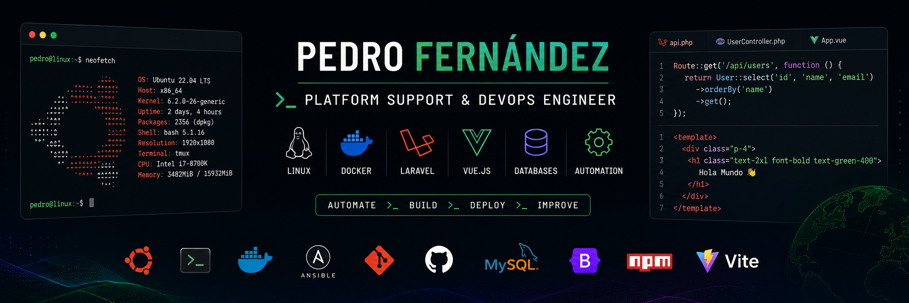

# 👋 Hi! I'm Pedro Fernández 

⚙️ Platform Support & DevOps Engineer  
💻 IT Technician specialized in platforms, automation and web development.  
🐧 Linux • Docker • Azure • Laravel • Vue.js • Ansible  
🚀 Support, infrastructure and backend development in real environments  
🎓 Higher Technician in ASIR and currently studying DAW.  

---

💼 Platform Support & DevOps Engineer | Backend & Automation

- ⚙️ Technical support and troubleshooting on client platforms
- 🐧 Linux Ubuntu server administration
- 🐳 Docker environment management
- 🔄 Task and infrastructure automation
- 🗄️ Database management and maintenance
- 🌐 Collaboration on Laravel + Vue.js projects
- 🔁 Version control and workflows with Git
- ☁️ Azure database administration (MySQL and NoSQL)

---

🛠️ Technologies & Tools

🌐 Languages  

⚙️ Frameworks & Libraries  

🗄️ Databases  

⚡ Environment & Build Tools  

🛠️ DevOps & Tools  

---

🚀 Featured Projects

🔹 [**Buena Vibra Remake**](https://github.com/PedferRodeira1/BuenaVibraRemake)  
Web application for a local restaurant in Moaña.  
- **Stack:** Laravel + Vue 3 + Tailwind + Vite  
- Internal management system + modern frontend.  

🔹 [**Semaphoro-Playbooks**](https://github.com/PedferRodeira1/Semaphoro-Playbooks)  
**Ansible** playbooks for automation.  
- Network scanning, hardware inventory, agent deployment, etc.  
- Excel export and usage in real environments.  

🔹 [**KonNichiwa**](https://github.com/PedferRodeira1/KonNichiwa)  
Personal project in **Python** focused on learning.  
- Practical exercises and practice programs.  

---

📊 GitHub Stats

  
  

---

📫 Contact

  
  

---

🧭 Currently exploring

- 🔹 Modern backend architectures with Laravel
- 🔹 Automation and CI/CD
- 🔹 Docker & containerized environments
- 🔹 Vue 3 & Composition API
- 🔹 Platform Engineering & DevOps

---

> "Always learning, always improving."
