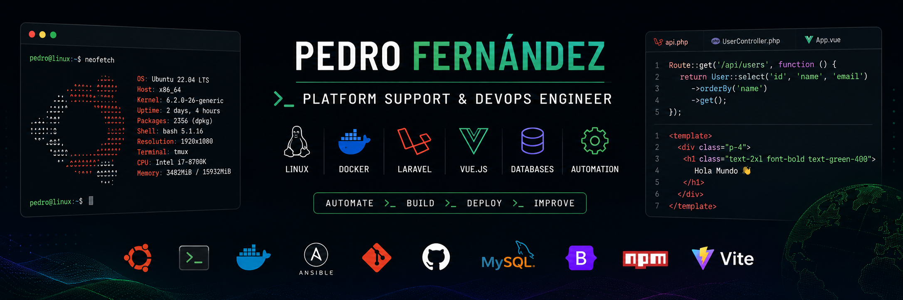

# 👋 ¡Hola! Soy Pedro Fernández

⚙️ **Platform Support & DevOps Engineer**  
💻 Técnico IT especializado en soporte de plataformas, automatización, infraestructura y desarrollo web.  
🐧 Linux • Docker • Azure • Laravel • Vue.js • Ansible  
🚀 Experiencia en soporte técnico, administración de sistemas y desarrollo backend en entornos reales.  
🎓 Técnico Superior en Administración de Sistemas Informáticos en Red y estudiante de Desarrollo de Aplicaciones Web.

  
  

---

## 💼 Perfil profesional

Trabajo en el área de soporte de plataformas y DevOps, participando en la resolución de incidencias, administración de sistemas, automatización de procesos y mantenimiento de infraestructuras.

También colaboro en proyectos de desarrollo web, principalmente con **Laravel** y **Vue.js**, combinando conocimientos de sistemas, backend y automatización.

### Principales responsabilidades

- ⚙️ Soporte técnico y troubleshooting sobre plataformas de clientes.
- 🐧 Administración y mantenimiento de servidores Linux Ubuntu.
- 🐳 Gestión de aplicaciones y entornos Docker.
- 🔄 Automatización de tareas operativas e infraestructura.
- 🗄️ Administración y mantenimiento de bases de datos.
- 🌐 Colaboración en proyectos desarrollados con Laravel y Vue.js.
- 🔁 Gestión de repositorios y flujos de trabajo con Git.
- ☁️ Administración de bases de datos MySQL y NoSQL en Azure.

---

## 🛠️ Tecnologías y herramientas

### 🌐 Lenguajes

  

### ⚙️ Frameworks y librerías

  

### 🗄️ Bases de datos

  

### ⚡ Entorno y herramientas de construcción

  

### 🛠️ DevOps, sistemas y control de versiones

  

---

## 🚀 Proyectos destacados

### 🍽️ [Buena Vibra Remake](https://github.com/PedferRodeira1/BuenaVibraRemake)

Aplicación web desarrollada para un restaurante local de Moaña.

- **Stack:** Laravel, Vue 3, Tailwind CSS y Vite.
- Sistema de gestión interna.
- Interfaz web moderna y adaptable.
- Integración entre backend y frontend.

### 🤖 [Semaphoro Playbooks](https://github.com/PedferRodeira1/Semaphoro-Playbooks)

Colección de playbooks de Ansible orientados a la automatización de tareas técnicas.

- Escaneo y reconocimiento de red.
- Recopilación de inventario de hardware.
- Despliegue automatizado de agentes.
- Exportación de resultados a Excel.
- Aplicación en entornos reales.

### 🐍 [KonNichiwa](https://github.com/PedferRodeira1/KonNichiwa)

Proyecto personal en Python orientado al aprendizaje y la práctica.

- Ejercicios de programación.
- Pequeñas aplicaciones y scripts.
- Consolidación de fundamentos de Python.

---

## 📊 Estadísticas de GitHub

  

  
  

  
  

---

## 🧭 Actualmente aprendiendo

- 🔹 Arquitecturas backend modernas con Laravel.
- 🔹 Automatización de infraestructura y procesos.
- 🔹 Integración y entrega continua con CI/CD.
- 🔹 Docker y entornos containerizados.
- 🔹 Vue 3 y Composition API.
- 🔹 Platform Engineering y prácticas DevOps.

---

## 📫 Contacto

  
  

---

> Automatizando procesos, resolviendo problemas y construyendo plataformas más fiables, eficientes y mantenibles.
